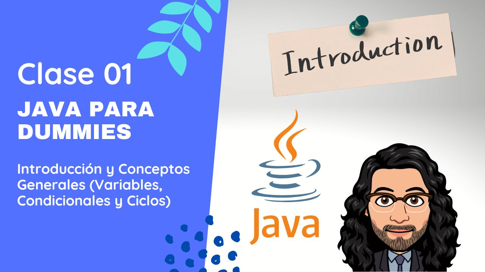

# Java Para Dummies MisionTIC2022

## Curso para aprender el lenguaje de programación Java desde cero y para principiantes

## Clases en vídeo

### Curso de fundamentos desde cero

Curso que agrupa todas las clases que hacen referencia a los fundamentos de Java.

> Código: Todo el código se encuentra en la raiz de este repositorio de Github

* [Lección 1 - Introducción y Conceptos Generales (Variables, Condicionales y Ciclos)](https://youtu.be/oEJbZx1dORk)
* [Lección 2 - Sintaxis y Ejercicios Prácticos en Java](https://youtu.be/6ieUGQOGc0A)
* [Lección 3 - ¿Cómo Trabajar con Arrays en Java?](https://youtu.be/fzYYCrBkB0Q)
* [Lección 4 - ¿Cómo Programo con Objetos?](https://youtu.be/WK63WL5aVTU)
* [Lección 5 - Métodos (Constructor, Get, Set, toString, Sobreescritura y Sobrecarga)](https://youtu.be/wkzEJy8MeOI)
* [Lección 6 - Ejercicios de Programación Básica (Clases Personaje, Autobus y SIMCard)](https://youtu.be/9SqAaN1zsdg)
* [Lección 7 - Herencia e Interfaces](https://youtu.be/fXsyg4rNYXs)
* [Lección 8 - Polimorfismo y Repaso de Objetos, Herencia e Interfaces](https://youtu.be/6AgGhnYh7zg)
* [Lección 9 - Ejercicio de Programación con Herencia (Clase Personaje, Jugador y Enemigo)](https://youtu.be/QjgsIljrcco)
* [Lección 10 - Ejercicio de Programación con Clases Abstractas (Botón, Asiento y Persona)](https://youtu.be/aVIYHuCpF6w)
* [Lección 11 - Interfaces Gráficas con Java Swing](https://youtu.be/6YYmZ8cQc7o)
* [Lección 12 - Introducción a Git y Github](https://youtu.be/vV9zscTerbk)
* [Lección 13 - Introducción a Java Spring Boot](https://youtu.be/HqVzJuUBKsY)
* [Lección 14 - Ciclo 3 MisiónTIC - CRUD Básico con Java Spring Boot](https://youtu.be/9dJ_94GLBSQ)
* [Lección 15 - Introducción a HTML y CSS](https://youtu.be/RrcUu1QnHbk)
* [Lección 16 - Integración Frontend y Backend - Operaciones CRUD desde Interfaz Gráfica](https://youtu.be/C5ldLB8zrJQ)

## Información importante y preguntas frecuentes

Actualmente el curso está finalizado. Se han realizado varios ejercicios prácticos y se explican varios conceptos vistos en el programa de MisionTIC 2022 del Ministerio de Tecnologías de la Información y Comunicaciones de Colombia (MinTIC), ese era el objetivo inicial del proyecto.

¡Muchísimas gracias por todo el apoyo mostrado!

## Enlaces de interés

* [Web oficial de Java](https://www.java.com/)

#### Puedes apoyar mi trabajo haciendo "☆ Star" en el repo o nominarme a "GitHub Star". ¡Gracias!

